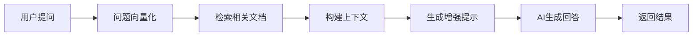

# 🔍 RAG 详解：让 AI 拥有"外挂"知识的秘密

> **从"闭卷考试"到"开卷考试"的AI革命**
> 一文掌握检索增强生成技术的核心原理与实战应用

---

## 🤔 为什么需要 RAG？

### 🧠 传统大语言模型的三大局限

想象一下，你让 ChatGPT 回答以下问题：

```
❌ 问题：你们公司2024年第三季度的财务报告怎么样？
🤖 回答：抱歉，我无法获取实时的公司财务信息...

❌ 问题：我的个人笔记里提到的那个Python项目进展如何？
🤖 回答：我无法访问您的个人文件...

❌ 问题：最新的GPT-5发布了哪些新功能？
🤖 回答：截至我的知识更新时间2024年1月，GPT-5尚未发布...
```

这就暴露了传统LLM的三大痛点：

| 局限性 | 问题描述 | 影响 |
|-------|----------|------|
| 🕐 **知识截止** | 训练数据有时间限制 | 无法获取最新信息 |
| 🔒 **私有数据** | 无法访问用户专属数据 | 不能处理个性化内容 |
| 🧠 **知识幻觉** | 不确定时可能编造答案 | 回答可能不准确 |

### 💡 RAG 的解决思路

**传统方式** = 闭卷考试（只能凭记忆回答）
```
用户问题 → 大语言模型 → 基于训练数据回答
```

**RAG 方式** = 开卷考试（可以查资料再回答）
```
用户问题 → 搜索相关资料 → 结合资料 + 大语言模型 → 准确回答
```

---

## 🎯 什么是 RAG？

### 📚 核心定义

**RAG（Retrieval-Augmented Generation）**：检索增强生成，是一种将**信息检索**与**文本生成**相结合的AI技术。

简单来说：
- **检索（Retrieval）**：从知识库中找到相关信息
- **增强（Augmented）**：用这些信息增强AI的回答能力
- **生成（Generation）**：基于检索到的信息生成准确回答

### 🌟 RAG 的优势

```javascript
// RAG 的核心价值
const RAGAdvantages = {
  实时性: "可以获取最新信息，不受训练时间限制",
  专业性: "能够访问专业领域的深度知识",
  个性化: "可以基于用户的私有数据定制回答",
  可验证: "回答有明确的信息来源，可以溯源验证",
  成本效益: "比重新训练模型更经济实用"
};
```

---

## ⚖️ RAG vs 其他方法

### 📊 技术方案对比

| 维度 | RAG | Fine-tuning微调 | 直接提示 |
|------|-----|-----------------|----------|
| **数据更新** | ✅ 实时更新 | ❌ 需要重新训练 | ❌ 受知识截止限制 |
| **实现难度** | 🟡 中等 | 🔴 复杂 | 🟢 简单 |
| **成本** | 🟡 中等 | 🔴 高昂 | 🟢 较低 |
| **准确性** | 🟢 高（有源可查） | 🟢 高（针对性强） | 🟡 中等 |
| **灵活性** | ✅ 高（易扩展） | ❌ 低（固化在模型中） | ✅ 高 |
| **适用场景** | 知识问答、文档检索 | 特定任务优化 | 通用对话 |

### 🎯 最佳选择建议

```
📖 文档问答、知识库检索 → 选择 RAG
🎯 特定任务深度优化 → 选择 Fine-tuning
💬 通用对话、创意写作 → 选择直接提示
```

---

## 🔧 RAG 如何工作？

### 🚀 基础工作流程



### 📋 五个核心步骤

```javascript
// RAG 工作流程详解
const RAGWorkflow = {
  "步骤1": {
    名称: "问题理解",
    操作: "将用户问题转换为向量表示",
    作用: "让计算机理解问题的语义含义"
  },

  "步骤2": {
    名称: "相关检索",
    操作: "在知识库中找到最相关的信息片段",
    作用: "提供准确、相关的背景信息"
  },

  "步骤3": {
    名称: "上下文构建",
    操作: "将检索到的信息组织成结构化上下文",
    作用: "为AI提供清晰的参考资料"
  },

  "步骤4": {
    名称: "提示增强",
    操作: "将上下文信息与原问题结合成完整提示",
    作用: "让AI基于可靠信息进行推理"
  },

  "步骤5": {
    名称: "答案生成",
    操作: "AI基于增强提示生成准确回答",
    作用: "产出有根据、可溯源的最终答案"
  }
};
```

---

## 💻 实践案例：从入门到精通

### 🌱 入门级：简单文档问答

让我们从最简单的例子开始，搭建一个基础的RAG系统：

```javascript
// 简化版 RAG 系统
class SimpleRAG {
  constructor() {
    this.documents = []; // 文档库
    this.openai = new OpenAI({ apiKey: process.env.OPENAI_API_KEY });
  }

  // 添加文档到知识库
  addDocument(title, content) {
    this.documents.push({ title, content });
  }

  // 简单关键词检索
  searchDocuments(question, maxResults = 2) {
    const keywords = question.toLowerCase().split(' ');

    return this.documents
      .map(doc => {
        // 计算匹配分数
        const score = keywords.reduce((count, keyword) => {
          return doc.content.toLowerCase().includes(keyword) ? count + 1 : count;
        }, 0);

        return { ...doc, score };
      })
      .filter(doc => doc.score > 0)
      .sort((a, b) => b.score - a.score)
      .slice(0, maxResults);
  }

  // RAG 问答
  async ask(question) {
    console.log(`🤔 问题：${question}`);

    // 1. 检索相关文档
    const relevantDocs = this.searchDocuments(question);
    console.log(`📚 找到 ${relevantDocs.length} 个相关文档`);

    // 2. 构建上下文
    const context = relevantDocs
      .map(doc => `文档《${doc.title}》：\n${doc.content}`)
      .join('\n\n---\n\n');

    // 3. 生成增强提示
    const prompt = `基于以下文档内容回答问题：

${context}

问题：${question}

请基于上述文档内容回答，如果文档中没有相关信息，请说明。`;

    // 4. 调用 AI 生成回答
    try {
      const response = await this.openai.chat.completions.create({
        model: "gpt-3.5-turbo",
        messages: [{ role: "user", content: prompt }],
        temperature: 0.3 // 降低随机性，提高准确性
      });

      const answer = response.choices[0].message.content;
      console.log(`🤖 回答：${answer}`);

      return {
        question,
        answer,
        sources: relevantDocs.map(doc => doc.title)
      };
    } catch (error) {
      console.error('❌ AI调用失败:', error);
      throw error;
    }
  }
}

// 使用示例
const rag = new SimpleRAG();

// 添加知识文档
rag.addDocument("React基础", `
React 是一个用于构建用户界面的 JavaScript 库。
主要特点：
1. 组件化开发：将界面拆分为独立的、可复用的组件
2. 虚拟DOM：提高渲染性能
3. 声明式编程：描述界面应该是什么样子，而不是如何变成那样
`);

rag.addDocument("Vue.js介绍", `
Vue.js 是一个渐进式的 JavaScript 框架。
核心特性：
1. 响应式数据绑定：数据变化自动更新界面
2. 组件系统：支持组件化开发
3. 指令系统：v-if、v-for等指令简化DOM操作
`);

// 进行问答
async function demo() {
  await rag.ask("React 和 Vue 的主要区别是什么？");
}

// demo();
```

**🎯 学习要点：**
- 理解 RAG 的基本流程：检索 → 构建上下文 → 生成回答
- 掌握关键词匹配的简单检索方法
- 学会构建有效的 AI 提示

### 🚀 进阶级：带向量搜索的 RAG

简单关键词匹配有局限性，让我们升级到语义搜索：

```javascript
// 进阶版 RAG：支持语义搜索
class AdvancedRAG {
  constructor(apiKey) {
    this.openai = new OpenAI({ apiKey });
    this.documents = [];
    this.embeddings = []; // 存储文档向量
  }

  // 获取文本向量
  async getEmbedding(text) {
    const response = await this.openai.embeddings.create({
      model: "text-embedding-ada-002",
      input: text
    });
    return response.data[0].embedding;
  }

  // 添加文档并生成向量
  async addDocument(title, content) {
    console.log(`📝 添加文档：${title}`);

    const embedding = await this.getEmbedding(content);

    this.documents.push({ title, content });
    this.embeddings.push(embedding);

    console.log(`✅ 文档向量化完成`);
  }

  // 计算余弦相似度
  cosineSimilarity(vecA, vecB) {
    const dotProduct = vecA.reduce((sum, a, i) => sum + a * vecB[i], 0);
    const magnitudeA = Math.sqrt(vecA.reduce((sum, a) => sum + a * a, 0));
    const magnitudeB = Math.sqrt(vecB.reduce((sum, b) => sum + b * b, 0));
    return dotProduct / (magnitudeA * magnitudeB);
  }

  // 语义搜索
  async searchBySemantic(question, topK = 2) {
    console.log(`🔍 语义搜索：${question}`);

    // 1. 获取问题向量
    const questionEmbedding = await this.getEmbedding(question);

    // 2. 计算与所有文档的相似度
    const similarities = this.embeddings.map((docEmbedding, index) => ({
      index,
      similarity: this.cosineSimilarity(questionEmbedding, docEmbedding),
      document: this.documents[index]
    }));

    // 3. 按相似度排序并返回top-k
    return similarities
      .sort((a, b) => b.similarity - a.similarity)
      .slice(0, topK)
      .map(item => ({
        ...item.document,
        similarity: item.similarity.toFixed(3)
      }));
  }

  // 增强版问答
  async ask(question) {
    console.log(`\n🤔 问题：${question}`);

    // 1. 语义搜索
    const relevantDocs = await this.searchBySemantic(question);

    console.log('📊 检索结果：');
    relevantDocs.forEach(doc => {
      console.log(`  - ${doc.title} (相似度: ${doc.similarity})`);
    });

    // 2. 构建增强上下文
    const context = relevantDocs
      .map(doc => `【${doc.title}】\n${doc.content}\n(相似度: ${doc.similarity})`)
      .join('\n\n---\n\n');

    // 3. 生成回答
    const prompt = `请基于以下参考文档回答问题。注意：只使用文档中的信息，如果信息不足请明确说明。

参考文档：
${context}

用户问题：${question}

回答要求：
1. 基于文档内容作答
2. 引用具体文档来源
3. 如信息不足，诚实说明`;

    const response = await this.openai.chat.completions.create({
      model: "gpt-3.5-turbo",
      messages: [{ role: "user", content: prompt }],
      temperature: 0.2
    });

    const answer = response.choices[0].message.content;
    console.log(`\n🤖 AI 回答：\n${answer}`);

    return {
      question,
      answer,
      sources: relevantDocs,
      context
    };
  }
}

// 使用示例
async function advancedDemo() {
  const advancedRAG = new AdvancedRAG(process.env.OPENAI_API_KEY);

  // 添加更丰富的文档
  await advancedRAG.addDocument("前端框架对比", `
  React、Vue 和 Angular 是三大主流前端框架：

  React:
  - 由 Facebook 开发
  - 函数式编程范式
  - JSX 语法
  - 单向数据流
  - 生态系统庞大

  Vue:
  - 由尤雨溪开发
  - 渐进式框架设计
  - 模板语法直观
  - 双向数据绑定
  - 学习曲线平缓

  Angular:
  - 由 Google 开发
  - 完整的 MVC 框架
  - TypeScript 为主
  - 依赖注入机制
  - 适合大型项目
  `);

  await advancedRAG.addDocument("JavaScript性能优化", `
  JavaScript 性能优化最佳实践：

  1. 减少DOM操作
  - 批量更新DOM
  - 使用 DocumentFragment
  - 避免频繁的样式计算

  2. 内存管理
  - 及时清理事件监听器
  - 避免内存泄漏
  - 合理使用闭包

  3. 异步编程
  - 使用 Promise 和 async/await
  - 避免阻塞主线程
  - 合理使用 Web Workers
  `);

  // 进行问答测试
  await advancedRAG.ask("如何选择合适的前端框架？");
  await advancedRAG.ask("JavaScript 内存优化有什么建议？");
}

// advancedDemo();
```

**🎯 进阶要点：**
- 掌握向量化技术和语义搜索
- 理解余弦相似度计算原理
- 学会构建更智能的检索系统

### 🏢 生产级：企业级 RAG 系统

最后，让我们构建一个接近生产环境的完整 RAG 系统：

```javascript
// 生产级 RAG 系统
class ProductionRAG {
  constructor(config) {
    this.openai = new OpenAI({ apiKey: config.apiKey });
    this.documents = new Map(); // 使用 Map 提高查询效率
    this.embeddings = new Map();
    this.metadata = new Map(); // 存储文档元数据

    // 配置参数
    this.chunkSize = config.chunkSize || 1000;
    this.overlap = config.overlap || 100;
    this.topK = config.topK || 3;
    this.temperature = config.temperature || 0.3;

    // 缓存机制
    this.cache = new Map();
    this.cacheExpiry = config.cacheExpiry || 3600000; // 1小时
  }

  // 智能文档分块
  chunkDocument(content, metadata = {}) {
    const chunks = [];

    // 按段落分割
    const paragraphs = content.split('\n\n').filter(p => p.trim());

    let currentChunk = '';
    let chunkIndex = 0;

    for (const paragraph of paragraphs) {
      // 检查是否超出chunk大小限制
      if ((currentChunk + '\n\n' + paragraph).length > this.chunkSize) {
        if (currentChunk.trim()) {
          chunks.push({
            id: `${metadata.docId || 'doc'}_chunk_${chunkIndex}`,
            content: currentChunk.trim(),
            index: chunkIndex,
            metadata: { ...metadata, chunkIndex }
          });
          chunkIndex++;
        }
        currentChunk = paragraph;
      } else {
        currentChunk = currentChunk ? currentChunk + '\n\n' + paragraph : paragraph;
      }
    }

    // 添加最后一个chunk
    if (currentChunk.trim()) {
      chunks.push({
        id: `${metadata.docId || 'doc'}_chunk_${chunkIndex}`,
        content: currentChunk.trim(),
        index: chunkIndex,
        metadata: { ...metadata, chunkIndex }
      });
    }

    return chunks;
  }

  // 批量添加文档
  async addDocuments(documents) {
    console.log(`📚 开始处理 ${documents.length} 个文档...`);

    const allChunks = [];

    for (const doc of documents) {
      const chunks = this.chunkDocument(doc.content, {
        docId: doc.id,
        title: doc.title,
        source: doc.source,
        timestamp: new Date().toISOString()
      });

      allChunks.push(...chunks);
    }

    console.log(`📝 共生成 ${allChunks.length} 个文档块，开始向量化...`);

    // 批量生成向量（提高效率）
    const batchSize = 20;
    for (let i = 0; i < allChunks.length; i += batchSize) {
      const batch = allChunks.slice(i, i + batchSize);

      await Promise.all(batch.map(async (chunk) => {
        const embedding = await this.getEmbedding(chunk.content);

        this.documents.set(chunk.id, chunk);
        this.embeddings.set(chunk.id, embedding);
        this.metadata.set(chunk.id, chunk.metadata);
      }));

      console.log(`✅ 完成 ${Math.min(i + batchSize, allChunks.length)}/${allChunks.length}`);
    }

    console.log(`🎉 所有文档处理完成！`);
  }

  // 混合检索策略
  async hybridSearch(query, options = {}) {
    const topK = options.topK || this.topK;

    // 1. 语义搜索
    const semanticResults = await this.semanticSearch(query, topK * 2);

    // 2. 关键词搜索
    const keywordResults = this.keywordSearch(query, topK);

    // 3. 结果融合（RRF - Reciprocal Rank Fusion）
    const fusedResults = this.fuseResults(semanticResults, keywordResults);

    return fusedResults.slice(0, topK);
  }

  async semanticSearch(query, topK) {
    const queryEmbedding = await this.getEmbedding(query);
    const similarities = [];

    for (const [id, embedding] of this.embeddings) {
      const similarity = this.cosineSimilarity(queryEmbedding, embedding);
      similarities.push({
        id,
        similarity,
        document: this.documents.get(id),
        metadata: this.metadata.get(id)
      });
    }

    return similarities
      .sort((a, b) => b.similarity - a.similarity)
      .slice(0, topK);
  }

  keywordSearch(query, topK) {
    const keywords = query.toLowerCase().split(/\s+/);
    const results = [];

    for (const [id, doc] of this.documents) {
      const content = doc.content.toLowerCase();
      const score = keywords.reduce((count, keyword) => {
        const matches = (content.match(new RegExp(keyword, 'g')) || []).length;
        return count + matches;
      }, 0);

      if (score > 0) {
        results.push({
          id,
          similarity: score / keywords.length,
          document: doc,
          metadata: this.metadata.get(id)
        });
      }
    }

    return results
      .sort((a, b) => b.similarity - a.similarity)
      .slice(0, topK);
  }

  fuseResults(semanticResults, keywordResults) {
    const resultMap = new Map();
    const k = 60; // RRF参数

    // 处理语义搜索结果
    semanticResults.forEach((result, index) => {
      const rrf = 1 / (k + index + 1);
      resultMap.set(result.id, {
        ...result,
        semanticRRF: rrf,
        keywordRRF: 0,
        semanticRank: index + 1,
        keywordRank: Infinity
      });
    });

    // 融合关键词搜索结果
    keywordResults.forEach((result, index) => {
      const rrf = 1 / (k + index + 1);

      if (resultMap.has(result.id)) {
        const existing = resultMap.get(result.id);
        existing.keywordRRF = rrf;
        existing.keywordRank = index + 1;
      } else {
        resultMap.set(result.id, {
          ...result,
          semanticRRF: 0,
          keywordRRF: rrf,
          semanticRank: Infinity,
          keywordRank: index + 1
        });
      }
    });

    // 计算最终分数并排序
    return Array.from(resultMap.values())
      .map(result => ({
        ...result,
        finalScore: result.semanticRRF + result.keywordRRF
      }))
      .sort((a, b) => b.finalScore - a.finalScore);
  }

  // 带缓存的问答
  async ask(question, options = {}) {
    // 检查缓存
    const cacheKey = this.getCacheKey(question, options);
    if (this.cache.has(cacheKey)) {
      const cached = this.cache.get(cacheKey);
      if (Date.now() - cached.timestamp < this.cacheExpiry) {
        console.log('📋 使用缓存结果');
        return cached.result;
      }
    }

    console.log(`\n🔍 问题：${question}`);
    const startTime = Date.now();

    try {
      // 1. 混合检索
      const retrievalStart = Date.now();
      const relevantChunks = await this.hybridSearch(question, options);
      const retrievalTime = Date.now() - retrievalStart;

      console.log(`📊 检索完成 (${retrievalTime}ms)，找到 ${relevantChunks.length} 个相关片段`);

      // 2. 构建上下文
      const context = this.buildContext(relevantChunks);

      // 3. 生成回答
      const generationStart = Date.now();
      const answer = await this.generateAnswer(question, context, options);
      const generationTime = Date.now() - generationStart;

      const result = {
        question,
        answer,
        sources: this.extractSources(relevantChunks),
        chunks: relevantChunks.map(chunk => ({
          content: chunk.document.content.substring(0, 200) + '...',
          similarity: chunk.similarity?.toFixed(3) || chunk.finalScore?.toFixed(3),
          source: chunk.metadata.title
        })),
        timing: {
          total: Date.now() - startTime,
          retrieval: retrievalTime,
          generation: generationTime
        }
      };

      // 缓存结果
      this.cache.set(cacheKey, {
        result,
        timestamp: Date.now()
      });

      console.log(`✅ 回答生成完成 (总耗时: ${result.timing.total}ms)`);
      return result;

    } catch (error) {
      console.error('❌ RAG查询失败:', error);
      throw error;
    }
  }

  buildContext(chunks) {
    return chunks
      .map(chunk => `【${chunk.metadata.title}】\n${chunk.document.content}`)
      .join('\n\n---\n\n');
  }

  async generateAnswer(question, context, options) {
    const prompt = `你是一个专业的AI助手。请基于提供的参考文档回答用户问题。

参考文档：
${context}

用户问题：${question}

回答要求：
1. 基于参考文档的内容进行回答
2. 引用具体的文档来源
3. 如果文档信息不足，请诚实说明
4. 保持回答的准确性和完整性
5. 使用清晰、专业的语言

请回答：`;

    const response = await this.openai.chat.completions.create({
      model: "gpt-3.5-turbo",
      messages: [{ role: "user", content: prompt }],
      temperature: options.temperature || this.temperature,
      max_tokens: options.maxTokens || 1500
    });

    return response.choices[0].message.content;
  }

  extractSources(chunks) {
    const sources = new Set();
    chunks.forEach(chunk => {
      if (chunk.metadata.title) {
        sources.add(chunk.metadata.title);
      }
    });
    return Array.from(sources);
  }

  getCacheKey(question, options) {
    return `${question}_${JSON.stringify(options)}`;
  }

  async getEmbedding(text) {
    const response = await this.openai.embeddings.create({
      model: "text-embedding-ada-002",
      input: text
    });
    return response.data[0].embedding;
  }

  cosineSimilarity(vecA, vecB) {
    const dotProduct = vecA.reduce((sum, a, i) => sum + a * vecB[i], 0);
    const magnitudeA = Math.sqrt(vecA.reduce((sum, a) => sum + a * a, 0));
    const magnitudeB = Math.sqrt(vecB.reduce((sum, b) => sum + b * b, 0));
    return dotProduct / (magnitudeA * magnitudeB);
  }

  // 系统统计
  getStats() {
    return {
      totalDocuments: this.documents.size,
      totalEmbeddings: this.embeddings.size,
      cacheSize: this.cache.size,
      memory: process.memoryUsage()
    };
  }
}

// 生产环境使用示例
async function productionDemo() {
  const ragSystem = new ProductionRAG({
    apiKey: process.env.OPENAI_API_KEY,
    chunkSize: 800,
    overlap: 100,
    topK: 3,
    temperature: 0.2,
    cacheExpiry: 1800000 // 30分钟缓存
  });

  // 企业级文档数据
  const enterpriseDocs = [
    {
      id: "frontend-guide",
      title: "前端开发最佳实践",
      source: "内部文档",
      content: `
        前端开发最佳实践指南

        1. 代码组织
        - 使用模块化开发
        - 遵循单一职责原则
        - 保持组件的可复用性

        2. 性能优化
        - 代码分割和懒加载
        - 图片优化和压缩
        - 缓存策略的合理使用

        3. 用户体验
        - 响应式设计
        - 加载状态提示
        - 错误处理和降级方案

        4. 代码质量
        - 使用ESLint和Prettier
        - 编写单元测试
        - 进行代码审查
      `
    },
    {
      id: "api-design",
      title: "RESTful API设计规范",
      source: "技术规范",
      content: `
        RESTful API 设计规范

        1. URL设计原则
        - 使用名词而非动词
        - 保持URL层级清晰
        - 使用复数形式

        2. HTTP方法使用
        - GET: 获取资源
        - POST: 创建资源
        - PUT: 更新整个资源
        - PATCH: 部分更新资源
        - DELETE: 删除资源

        3. 状态码规范
        - 200: 成功
        - 201: 创建成功
        - 400: 客户端错误
        - 401: 未授权
        - 404: 资源不存在
        - 500: 服务器错误

        4. 响应格式
        - 统一使用JSON格式
        - 包含状态码和消息
        - 提供详细的错误信息
      `
    }
  ];

  // 添加文档
  await ragSystem.addDocuments(enterpriseDocs);

  // 进行企业级问答
  console.log('\n🏢 企业级RAG系统演示');

  const questions = [
    "前端性能优化有哪些具体措施？",
    "API设计中如何正确使用HTTP方法？",
    "如何保证代码质量？"
  ];

  for (const question of questions) {
    const result = await ragSystem.ask(question);

    console.log(`\n📝 问题: ${result.question}`);
    console.log(`🤖 回答: ${result.answer}`);
    console.log(`📚 来源: ${result.sources.join(', ')}`);
    console.log(`⏱️ 耗时: ${result.timing.total}ms`);
  }

  // 显示系统统计
  console.log('\n📊 系统统计:', ragSystem.getStats());
}

// productionDemo();
```

**🎯 生产级要点：**
- 掌握文档分块和批量处理策略
- 理解混合检索和结果融合算法
- 学会实现缓存机制和性能优化
- 了解企业级系统的监控和统计

---

## ❓ 常见问题与解决方案

### 🔧 技术问题

#### Q1: 如何选择合适的文档分块大小？

```javascript
// 分块大小对比分析
const chunkSizeAnalysis = {
  "小分块 (200-500字)": {
    优点: ["检索精度高", "相关性强", "处理速度快"],
    缺点: ["上下文信息少", "可能断章取义"],
    适用: "精确问答、关键词检索"
  },

  "中等分块 (500-1000字)": {
    优点: ["平衡精度和上下文", "通用性好"],
    缺点: ["需要更多调优"],
    适用: "通用知识问答、文档检索"
  },

  "大分块 (1000-2000字)": {
    优点: ["上下文丰富", "信息完整"],
    缺点: ["检索精度可能降低", "token消耗多"],
    适用: "复杂推理、长文本理解"
  }
};

// 自适应分块策略
function adaptiveChunking(document) {
  const contentLength = document.content.length;

  if (contentLength < 1000) {
    return { chunkSize: 300, overlap: 50 };
  } else if (contentLength < 5000) {
    return { chunkSize: 600, overlap: 100 };
  } else {
    return { chunkSize: 1000, overlap: 150 };
  }
}
```

#### Q2: 如何提高检索精度？

```javascript
// 检索优化策略
const retrievalOptimization = {
  "混合检索": "结合语义搜索和关键词搜索",
  "查询重写": "将用户问题改写为更适合检索的形式",
  "结果重排": "使用专门的重排模型优化结果顺序",
  "多轮检索": "基于第一轮结果进行二次检索",
  "过滤机制": "根据相似度阈值过滤低质量结果"
};

// 查询重写示例
async function queryRewrite(originalQuery) {
  const rewritePrompt = `请将下面的用户问题改写为更适合文档检索的形式，保持原意但使用更精确的关键词：

原问题: ${originalQuery}

改写后的检索查询:`;

  const response = await openai.chat.completions.create({
    model: "gpt-3.5-turbo",
    messages: [{ role: "user", content: rewritePrompt }],
    temperature: 0.1
  });

  return response.choices[0].message.content.trim();
}
```

#### Q3: 如何控制成本？

```javascript
// 成本优化策略
const costOptimization = {
  "缓存机制": "缓存常见问题的结果，避免重复计算",
  "批量操作": "批量生成向量，减少API调用次数",
  "模型选择": "根据任务复杂度选择合适的模型",
  "token管理": "优化上下文长度，控制token消耗",
  "预处理": "在本地完成尽可能多的预处理工作"
};

// 成本估算工具
class CostEstimator {
  constructor() {
    this.prices = {
      'text-embedding-ada-002': 0.0001, // 每1K tokens
      'gpt-3.5-turbo': 0.002, // 每1K tokens
      'gpt-4': 0.06 // 每1K tokens
    };
  }

  estimateEmbeddingCost(textLength) {
    const tokens = Math.ceil(textLength / 4); // 粗略估算
    return (tokens / 1000) * this.prices['text-embedding-ada-002'];
  }

  estimateQueryCost(contextLength, model = 'gpt-3.5-turbo') {
    const tokens = Math.ceil(contextLength / 4);
    return (tokens / 1000) * this.prices[model];
  }
}
```

---

## 🚀 学习路径建议

### 📚 前置知识要求

```
基础要求 (⭐⭐⭐):
├── JavaScript/Python 编程基础
├── API 调用和异步编程
├── 基本的自然语言处理概念
└── 向量和相似度计算原理

进阶要求 (⭐⭐⭐⭐):
├── 大语言模型基础知识
├── 向量数据库操作
├── 系统架构设计
└── 性能优化策略
```

### 🎯 分阶段学习计划

```javascript
const learningPath = {
  "第一周: 基础概念": {
    目标: "理解RAG的核心原理",
    任务: [
      "学习向量化和语义搜索概念",
      "完成简单的文档问答项目",
      "理解检索-生成流程"
    ],
    实践: "搭建本文档中的 SimpleRAG 系统"
  },

  "第二周: 技术实现": {
    目标: "掌握RAG技术细节",
    任务: [
      "学习文档分块策略",
      "实现向量搜索功能",
      "优化提示工程"
    ],
    实践: "升级到 AdvancedRAG 系统"
  },

  "第三周: 系统优化": {
    目标: "构建生产级系统",
    任务: [
      "实现混合检索策略",
      "添加缓存和监控",
      "性能调优和成本控制"
    ],
    实践: "完成 ProductionRAG 系统"
  },

  "第四周: 项目实战": {
    目标: "解决实际业务问题",
    任务: [
      "选择实际使用场景",
      "部署和测试系统",
      "收集反馈并迭代"
    ],
    实践: "构建你自己的RAG应用"
  }
};
```

### 🎪 推荐实践项目

```javascript
const practiceProjects = [
  {
    name: "个人知识库助手",
    difficulty: "⭐⭐⭐",
    description: "为你的学习笔记和文档建立智能问答系统",
    skills: ["文档处理", "基础RAG", "用户界面"]
  },

  {
    name: "API文档智能助手",
    difficulty: "⭐⭐⭐⭐",
    description: "为开源项目的API文档创建智能查询系统",
    skills: ["混合检索", "代码理解", "技术问答"]
  },

  {
    name: "企业内部知识库",
    difficulty: "⭐⭐⭐⭐⭐",
    description: "构建支持多用户的企业级知识管理系统",
    skills: ["系统架构", "用户管理", "权限控制", "性能优化"]
  }
];
```

### 🔗 学习资源推荐

```javascript
const resources = {
  "理论学习": [
    "《Retrieval-Augmented Generation for Large Language Models》原论文",
    "OpenAI Embeddings API 官方文档",
    "LangChain RAG 教程",
    "Pinecone 向量数据库教程"
  ],

  "实践工具": [
    "OpenAI API (文本生成和向量化)",
    "LangChain (RAG框架)",
    "Chroma/Pinecone (向量数据库)",
    "Streamlit (快速构建界面)"
  ],

  "进阶阅读": [
    "RAG vs Fine-tuning 对比研究",
    "多模态RAG系统设计",
    "RAG系统评估方法",
    "向量数据库性能优化"
  ]
};
```

---

## 🎉 总结

RAG技术正在改变AI应用的方式，从"闭卷考试"到"开卷考试"的转变，让AI能够：

- ✅ **获取实时信息**：不再受限于训练时间
- ✅ **访问专业知识**：深入垂直领域
- ✅ **处理私有数据**：个性化和定制化
- ✅ **提供可靠回答**：有源可查，可以验证

### 🚀 下一步行动

1. **动手实践**：从 SimpleRAG 开始，逐步升级到生产级系统
2. **选择场景**：找到适合的应用场景，解决实际问题
3. **持续优化**：根据用户反馈不断改进系统性能
4. **深入学习**：关注最新的RAG技术发展趋势

记住：**最好的学习方式就是动手做！** 选择一个你感兴趣的场景，开始构建你的第一个RAG系统吧！

---

*💡 有任何RAG技术问题，随时可以问我！我会结合最新的技术动态为你答疑解惑！* 🤖✨