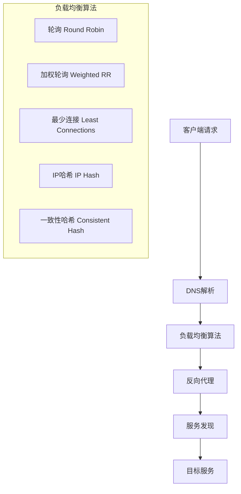
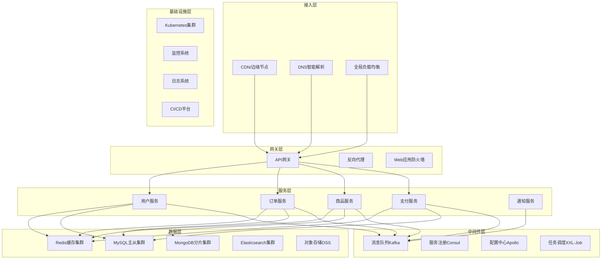

# 现代服务端架构完整性分析

## 🎯 概述

本文档从系统架构师的角度，深入分析现代服务端架构的完整性、技术原理和选择策略，构建一个基于原理的架构决策框架。

---

## 1. 架构完整性评估

### 1.1 现有架构组件
基于当前架构文档，已覆盖的核心组件：
- **网关层**: Nginx (反向代理、负载均衡)
- **编排层**: Kubernetes (容器编排)
- **容器化**: Docker (应用打包)
- **缓存层**: Redis (内存缓存)
- **计算层**: Server (业务逻辑)
- **存储层**: RDS (关系型数据库)、OSS (对象存储)
- **日志层**: SLS (日志服务)

### 1.2 缺失的关键组件

#### 🔍 服务治理层
```yaml
缺失组件:
  服务注册发现:
    - Consul, Eureka, Nacos
    - 动态服务路由
    - 健康检查机制

  配置管理:
    - Apollo, Nacos, Consul KV
    - 动态配置更新
    - 配置版本管理

  API网关:
    - Kong, Zuul, Spring Cloud Gateway
    - 统一鉴权
    - 流量控制
    - API文档管理
```

#### 📨 消息中间件
```yaml
异步通信:
  消息队列:
    - RabbitMQ, Apache Kafka, RocketMQ
    - 事件驱动架构
    - 削峰填谷
    - 解耦服务间通信

  流式处理:
    - Apache Kafka Streams
    - Apache Flink
    - 实时数据处理
```

#### 🔍 搜索引擎
```yaml
全文搜索:
  搜索引擎:
    - Elasticsearch
    - Apache Solr
    - 商品搜索
    - 日志分析
    - 复杂查询
```

#### 📊 监控观测
```yaml
可观测性:
  指标监控:
    - Prometheus + Grafana
    - InfluxDB + Grafana
    - 业务指标监控

  链路追踪:
    - Jaeger, Zipkin, SkyWalking
    - 分布式调用链
    - 性能瓶颈定位

  应用性能监控:
    - New Relic, Datadog, OneAPM
    - 代码级性能监控
```

#### 🛡️ 安全组件
```yaml
安全防护:
  身份认证:
    - OAuth2, JWT
    - 单点登录(SSO)
    - 多因子认证(MFA)

  Web应用防火墙:
    - WAF防护
    - DDoS防护
    - SQL注入防护

  秘钥管理:
    - HashiCorp Vault
    - 证书管理
    - 敏感信息加密
```

#### 🔄 CI/CD工具链
```yaml
持续集成交付:
  版本控制:
    - Git, GitLab, GitHub
    - 代码审查流程

  构建部署:
    - Jenkins, GitLab CI, GitHub Actions
    - 自动化测试
    - 蓝绿部署、金丝雀发布

  制品管理:
    - Harbor, Nexus
    - Docker镜像仓库
```

---

## 2. 技术原理抽象

### 2.1 核心技术原理映射

#### 🌐 网络通信原理


**原理核心**：
- **DNS解析**: 域名到IP地址映射
- **负载均衡**: 请求分发算法优化
- **反向代理**: 隐藏后端服务细节
- **服务发现**: 动态服务实例管理

#### 💾 存储原理分层
```yaml
存储层次架构:
  L1_CPU缓存:
    - 访问时间: ~1ns
    - 容量: KB级别
    - 用途: 指令和数据缓存

  L2_内存缓存:
    - 访问时间: ~100ns
    - 容量: GB级别
    - 技术: Redis, Memcached
    - 原理: 内存存储、LRU淘汰

  L3_SSD存储:
    - 访问时间: ~100μs
    - 容量: TB级别
    - 技术: NVMe SSD
    - 原理: 闪存存储

  L4_机械硬盘:
    - 访问时间: ~10ms
    - 容量: PB级别
    - 用途: 大容量存储、备份

  L5_对象存储:
    - 访问时间: ~100ms
    - 容量: 无限扩展
    - 技术: S3, OSS
    - 原理: 分布式存储、副本机制
```

#### 🔄 缓存原理与策略
```javascript
// 缓存策略原理实现
class CacheStrategy {
  // 缓存穿透解决方案：布隆过滤器
  bloomFilter = new BloomFilter(1000000, 0.1);

  // Cache-Aside 模式
  async cacheAside(key, dataLoader) {
    // 1. 先查缓存
    let data = await redis.get(key);
    if (data) return JSON.parse(data);

    // 2. 缓存未命中，查数据库
    data = await dataLoader();
    if (data) {
      // 3. 写入缓存
      await redis.setex(key, 3600, JSON.stringify(data));
    }
    return data;
  }

  // Write-Through 模式
  async writeThrough(key, data) {
    // 同时写入缓存和数据库
    await Promise.all([
      redis.setex(key, 3600, JSON.stringify(data)),
      database.save(data)
    ]);
  }

  // Write-Behind 模式
  async writeBehind(key, data) {
    // 先写缓存，异步写数据库
    await redis.setex(key, 3600, JSON.stringify(data));
    setImmediate(() => database.save(data));
  }
}
```

#### 📊 数据库原理深入
```sql
-- 事务ACID原理示例
BEGIN TRANSACTION;
  -- Atomicity: 原子性
  UPDATE accounts SET balance = balance - 100 WHERE id = 1;
  UPDATE accounts SET balance = balance + 100 WHERE id = 2;

  -- Consistency: 一致性检查
  IF (SELECT balance FROM accounts WHERE id = 1) < 0 THEN
    ROLLBACK;
  ELSE
    COMMIT;
  END IF;

-- Isolation: 隔离级别
SET TRANSACTION ISOLATION LEVEL READ COMMITTED;

-- Durability: 持久性通过WAL实现
-- Write-Ahead Logging确保数据持久化
```

**数据库选择原理**：
- **ACID vs BASE**: 强一致性 vs 最终一致性
- **SQL vs NoSQL**: 结构化 vs 非结构化数据
- **OLTP vs OLAP**: 事务处理 vs 分析处理

#### 🏗️ 微服务架构原理
```yaml
微服务核心原理:
  服务拆分原则:
    - 业务边界清晰 (Domain-Driven Design)
    - 数据独立性 (Database Per Service)
    - 团队自治性 (Conway's Law)
    - 技术栈独立 (Polyglot Programming)

  通信模式:
    - 同步通信: HTTP/REST, gRPC
    - 异步通信: 消息队列, 事件总线
    - 服务网格: Service Mesh, Sidecar模式

  数据一致性:
    - 分布式事务: 2PC, 3PC
    - 补偿模式: Saga Pattern
    - 事件溯源: Event Sourcing
```

---

## 3. 同类产品对比分析

### 3.1 反向代理/负载均衡器
```yaml
Nginx:
  优势: [高性能, 轻量级, 配置灵活, 生态丰富]
  劣势: [配置复杂, 热更新困难]
  适用: [静态文件服务, SSL终端, 基础负载均衡]
  性能: 50,000+ 并发连接

HAProxy:
  优势: [专业负载均衡, 健康检查强, 统计丰富]
  劣势: [不支持缓存, 配置语法独特]
  适用: [TCP/HTTP负载均衡, 高可用架构]
  性能: 100,000+ 并发连接

Traefik:
  优势: [自动服务发现, 现代化UI, 云原生]
  劣势: [相对较新, 性能不如Nginx]
  适用: [容器环境, 微服务架构]
  性能: 20,000+ 并发连接

选择策略:
  - 静态网站 → Nginx
  - 微服务 → Traefik/Envoy
  - 传统应用 → HAProxy
  - 云环境 → 云厂商LB
```

### 3.2 容器编排平台
```yaml
Kubernetes:
  优势: [生态最丰富, 社区活跃, 标准化]
  劣势: [学习曲线陡峭, 复杂度高]
  适用: [大规模生产环境, 多云架构]
  市场占有率: 90%+

Docker Swarm:
  优势: [简单易用, 与Docker集成好]
  劣势: [功能有限, 生态较小]
  适用: [小规模集群, 快速原型]
  市场占有率: 5%

Apache Mesos:
  优势: [资源利用率高, 支持多框架]
  劣势: [复杂度高, 维护困难]
  适用: [大数据平台, 混合工作负载]
  市场占有率: <5%

选择策略:
  - 生产环境 → Kubernetes
  - 开发测试 → Docker Swarm
  - 大数据场景 → Mesos
```

### 3.3 缓存解决方案
```yaml
Redis:
  优势: [数据结构丰富, 持久化, 高可用, 生态好]
  劣势: [内存占用高, 单线程模型]
  适用: [会话存储, 排行榜, 消息队列]
  性能: 100,000+ QPS

Memcached:
  优势: [简单高效, 多线程, 内存利用率高]
  劣势: [功能单一, 无持久化]
  适用: [纯缓存场景, 大规模读取]
  性能: 200,000+ QPS

Hazelcast:
  优势: [分布式计算, Java生态, IMDG]
  劣势: [内存消耗大, 复杂度高]
  适用: [分布式计算, 企业级应用]
  性能: 50,000+ QPS

选择策略:
  - 通用缓存 → Redis
  - 纯缓存 → Memcached
  - 分布式计算 → Hazelcast
```

### 3.4 数据库技术选型
```yaml
关系型数据库:
  MySQL:
    优势: [成熟稳定, 生态丰富, 成本低]
    劣势: [复杂查询性能一般, 水平扩展困难]
    适用: [Web应用, 事务性系统]

  PostgreSQL:
    优势: [功能强大, 扩展性好, JSON支持]
    劣势: [内存消耗大, 运维复杂]
    适用: [复杂查询, 数据分析]

  Oracle:
    优势: [企业级特性, 性能强]
    劣势: [成本高, 厂商锁定]
    适用: [大型企业, 关键业务]

NoSQL数据库:
  MongoDB:
    优势: [文档模型灵活, 水平扩展]
    劣势: [事务支持弱, 内存消耗大]
    适用: [内容管理, 实时分析]

  Cassandra:
    优势: [高可用, 线性扩展, 写性能强]
    劣势: [最终一致性, 运维复杂]
    适用: [时序数据, 大规模写入]

  DynamoDB:
    优势: [全托管, 自动扩缩容]
    劣势: [厂商锁定, 成本高]
    适用: [AWS生态, Serverless]

选择策略矩阵:
  数据结构化程度:
    - 高度结构化 → 关系型数据库
    - 半结构化 → 文档数据库
    - 非结构化 → 对象存储

  事务要求:
    - 强事务 → 关系型数据库
    - 弱事务 → NoSQL数据库

  扩展需求:
    - 垂直扩展 → 关系型数据库
    - 水平扩展 → NoSQL数据库
```

### 3.5 消息队列对比
```yaml
RabbitMQ:
  特点: [AMQP协议, 功能丰富, 路由灵活]
  性能: 20,000 msg/s
  适用: [复杂路由, 小消息量, 可靠性要求高]

Apache Kafka:
  特点: [高吞吐, 持久化, 流处理]
  性能: 1,000,000+ msg/s
  适用: [大数据, 流处理, 日志收集]

RocketMQ:
  特点: [顺序消息, 事务消息, 延时消息]
  性能: 100,000 msg/s
  适用: [电商场景, 金融系统]

Apache Pulsar:
  特点: [多租户, 地理复制, 统一模型]
  性能: 500,000 msg/s
  适用: [云原生, 多租户场景]

选择策略:
  - 高吞吐量 → Kafka
  - 复杂路由 → RabbitMQ
  - 事务消息 → RocketMQ
  - 云原生 → Pulsar
```

### 3.6 对象存储服务
```yaml
AWS S3:
  优势: [生态最好, 功能最全, 全球部署]
  劣势: [成本较高, 延迟问题]
  适用: [全球业务, AWS生态]

阿里云OSS:
  优势: [国内访问快, 成本适中, 中文文档]
  劣势: [国际化程度低]
  适用: [国内业务, 阿里云生态]

MinIO:
  优势: [开源, 私有部署, S3兼容]
  劣势: [功能相对简单, 需自行运维]
  适用: [私有云, 成本敏感]

Azure Blob:
  优势: [与Azure集成好, 企业级特性]
  劣势: [生态相对较小]
  适用: [微软技术栈, 企业场景]

选择策略:
  - 公有云优先 → 云厂商OSS
  - 私有部署 → MinIO
  - 混合云 → S3兼容方案
```

---

## 4. 选择标准框架

### 4.1 技术选型决策矩阵

#### 🎯 业务场景驱动选型
```yaml
电商系统:
  特点: [高并发读, 事务性强, 数据一致性要求高]
  技术选型:
    网关: Nginx + Kong
    缓存: Redis Cluster
    数据库: MySQL读写分离 + MongoDB商品库
    消息队列: RocketMQ
    搜索: Elasticsearch

社交媒体:
  特点: [读多写少, 数据量大, 实时性要求高]
  技术选型:
    网关: Traefik
    缓存: Redis + CDN
    数据库: MySQL + Cassandra
    消息队列: Kafka
    搜索: Elasticsearch

IoT平台:
  特点: [海量写入, 时序数据, 数据分析需求]
  技术选型:
    网关: Nginx
    缓存: Redis
    数据库: InfluxDB + PostgreSQL
    消息队列: Kafka
    流处理: Apache Flink

金融系统:
  特点: [强一致性, 高可用, 安全性要求极高]
  技术选型:
    网关: F5 + WAF
    缓存: Redis哨兵模式
    数据库: Oracle RAC
    消息队列: RocketMQ
    监控: 全链路监控
```

#### 📊 性能要求矩阵
```yaml
并发量级选型:
  低并发(< 1000 QPS):
    架构: 单体应用
    数据库: MySQL单机
    缓存: 本地缓存
    部署: 单机部署

  中等并发(1000-10000 QPS):
    架构: 微服务
    数据库: MySQL主从
    缓存: Redis单机
    部署: 容器化部署

  高并发(10000-100000 QPS):
    架构: 微服务 + 服务网格
    数据库: MySQL集群 + 读写分离
    缓存: Redis集群
    部署: K8s + 自动扩缩容

  超高并发(> 100000 QPS):
    架构: 分布式架构 + 边缘计算
    数据库: 分库分表 + NoSQL
    缓存: 多级缓存
    部署: 多云部署
```

#### 💰 成本考虑因素
```yaml
成本结构分析:
  人力成本:
    开源方案: 高运维成本, 低License成本
    商业方案: 低运维成本, 高License成本
    云服务: 中等成本, 按需付费

  基础设施成本:
    自建IDC: 高初期投入, 低运营成本
    云服务: 低初期投入, 高运营成本
    混合云: 平衡初期投入和运营成本

  技术栈成本:
    开源栈: PostgreSQL + Redis + Kafka
    商业栈: Oracle + IBM MQ + Splunk
    云原生栈: 云数据库 + 云缓存 + 云消息队列

成本优化策略:
  - 开发阶段: 开源方案降低成本
  - 增长阶段: 云服务提高效率
  - 成熟阶段: 混合方案优化成本
```

#### 🔧 技术团队能力评估
```yaml
团队技能矩阵:
  初级团队:
    推荐: 云服务 + 开源工具
    避免: 复杂分布式系统
    培训重点: 容器化, 云原生基础

  中级团队:
    推荐: 微服务 + K8s
    能力: 自建中间件
    培训重点: 分布式系统, 性能优化

  高级团队:
    能力: 自研框架, 深度定制
    重点: 架构创新, 技术前瞻

技能培养路径:
  1. 基础设施 → 容器化 → 云原生
  2. 单体应用 → 微服务 → 分布式
  3. 监控告警 → 可观测性 → 智能运维
```

### 4.2 风险评估框架

#### ⚠️ 技术风险评估
```yaml
风险等级矩阵:
  高风险:
    - 新兴技术 (< 2年)
    - 小众方案 (社区< 1000)
    - 单一厂商依赖
    - 没有成功案例

  中风险:
    - 较新技术 (2-5年)
    - 中等社区规模
    - 可替代方案存在
    - 有类似规模案例

  低风险:
    - 成熟技术 (> 5年)
    - 大型社区支持
    - 多个厂商支持
    - 大量成功案例

风险缓解策略:
  - 技术预研和POC验证
  - 多厂商方案对比
  - 渐进式迁移策略
  - 应急回滚方案
```

#### 🔄 可扩展性评估
```yaml
扩展维度:
  计算扩展:
    - 垂直扩展: CPU/内存升级
    - 水平扩展: 实例数量增加
    - 弹性扩展: 自动扩缩容

  存储扩展:
    - 容量扩展: 存储空间增加
    - 性能扩展: IOPS/带宽提升
    - 分布式扩展: 数据分片

  网络扩展:
    - 带宽扩展: 网络容量增加
    - 地域扩展: 多地域部署
    - 边缘扩展: CDN/边缘计算

扩展性评分:
  - 1分: 难以扩展
  - 3分: 有限扩展
  - 5分: 线性扩展
  - 7分: 弹性扩展
  - 10分: 无限扩展
```

---

## 5. 架构层次划分

### 5.1 基于功能的分层架构

#### 🌐 接入层 (Access Layer)
```yaml
组件职责:
  CDN/边缘节点:
    - 静态资源缓存
    - 就近访问优化
    - 带宽优化

  DNS解析:
    - 智能解析
    - 负载均衡
    - 故障切换

  全局负载均衡:
    - 跨地域流量分发
    - 健康检查
    - 容灾切换

技术选型:
  - CDN: CloudFlare, AWS CloudFront, 阿里云CDN
  - DNS: Route53, DNSPod, 阿里云DNS
  - GSLB: F5 GTM, Citrix ADC
```

#### 🚪 网关层 (Gateway Layer)
```yaml
组件职责:
  API网关:
    - 统一入口
    - 协议转换
    - 认证授权
    - 流量控制
    - API管理

  反向代理:
    - 请求转发
    - SSL终端
    - 请求重写
    - 响应缓存

技术选型:
  - API网关: Kong, Zuul, Spring Cloud Gateway
  - 反向代理: Nginx, HAProxy, Traefik
  - 服务网格: Istio, Linkerd, Consul Connect
```

#### 🎛️ 服务层 (Service Layer)
```yaml
组件职责:
  业务服务:
    - 核心业务逻辑
    - 数据处理
    - 业务规则

  基础服务:
    - 用户服务
    - 认证服务
    - 通知服务
    - 配置服务

  中间件服务:
    - 消息队列
    - 任务调度
    - 工作流引擎

架构模式:
  - 微服务架构
  - 领域驱动设计(DDD)
  - 事件驱动架构(EDA)
  - CQRS + Event Sourcing
```

#### 💾 数据层 (Data Layer)
```yaml
组件职责:
  缓存层:
    - 热点数据缓存
    - 会话存储
    - 分布式锁

  存储层:
    - 关系型数据库
    - NoSQL数据库
    - 对象存储
    - 文件系统

  数据处理:
    - 数据仓库
    - 数据湖
    - 流处理
    - 批处理

数据架构模式:
  - Lambda架构
  - Kappa架构
  - 数据湖架构
  - 湖仓一体架构
```

#### 🔧 基础设施层 (Infrastructure Layer)
```yaml
组件职责:
  容器编排:
    - Kubernetes
    - Docker Swarm
    - 容器运行时

  监控观测:
    - 指标监控
    - 日志聚合
    - 链路追踪
    - 告警通知

  CI/CD:
    - 代码仓库
    - 构建系统
    - 部署平台
    - 制品仓库

运维体系:
  - 基础设施即代码(IaC)
  - GitOps
  - 混沌工程
  - SRE实践
```

### 5.2 完整架构参考模型

#### 🏗️ 云原生架构全景图


#### 📊 架构复杂度演进路径
```yaml
演进阶段:
  Stage 1 - 单体应用:
    特点: 简单部署, 开发效率高
    适用: 初创项目, 用户< 10万
    技术栈: Nginx + 单体应用 + MySQL + Redis

  Stage 2 - 垂直拆分:
    特点: 按业务模块拆分
    适用: 用户10万-100万
    技术栈: 负载均衡 + 多个应用 + 读写分离

  Stage 3 - 微服务化:
    特点: 服务细粒度拆分
    适用: 用户100万-1000万
    技术栈: 服务网格 + 微服务 + 分布式数据库

  Stage 4 - 平台化:
    特点: 服务平台化, 中台架构
    适用: 用户> 1000万
    技术栈: 云原生 + 服务平台 + 大数据平台

演进策略:
  - 业务驱动: 根据业务规模调整架构
  - 技术驱动: 引入新技术解决瓶颈
  - 团队驱动: 组织架构与技术架构匹配
  - 成本驱动: 在功能和成本间找平衡
```

### 5.3 架构质量属性

#### 🎯 可用性设计
```yaml
高可用策略:
  冗余设计:
    - 多实例部署
    - 多地域部署
    - 多云部署

  故障检测:
    - 健康检查
    - 心跳监控
    - 故障转移

  容错处理:
    - 熔断器模式
    - 重试机制
    - 降级策略

  恢复机制:
    - 自动恢复
    - 数据备份
    - 灾难恢复

可用性等级:
  - 99.9%: 年停机8.76小时 (基础级)
  - 99.99%: 年停机52.56分钟 (高可用)
  - 99.999%: 年停机5.26分钟 (极高可用)
```

#### ⚡ 性能设计
```yaml
性能优化策略:
  计算性能:
    - 算法优化
    - 并发处理
    - 异步编程
    - 缓存策略

  网络性能:
    - CDN加速
    - 压缩传输
    - 连接复用
    - 协议优化

  存储性能:
    - 索引优化
    - 分库分表
    - 读写分离
    - 存储分层

性能指标:
  - 响应时间: P50, P95, P99
  - 吞吐量: QPS, TPS
  - 并发数: 同时在线用户数
  - 资源利用率: CPU, 内存, 磁盘, 网络
```

#### 🔒 安全性设计
```yaml
安全防护体系:
  网络安全:
    - DDoS防护
    - 入侵检测
    - 网络隔离
    - VPN访问

  应用安全:
    - 输入验证
    - SQL注入防护
    - XSS防护
    - CSRF防护

  数据安全:
    - 传输加密
    - 存储加密
    - 密钥管理
    - 数据脱敏

  身份安全:
    - 多因子认证
    - 单点登录
    - 权限控制
    - 审计日志

安全等级:
  - Level 1: 基础防护
  - Level 2: 主动防御
  - Level 3: 智能安全
  - Level 4: 零信任架构
```

#### 📈 可扩展性设计
```yaml
扩展策略:
  水平扩展:
    - 负载均衡
    - 分布式部署
    - 微服务架构
    - 容器编排

  垂直扩展:
    - 硬件升级
    - 性能调优
    - 资源优化

  弹性扩展:
    - 自动扩缩容
    - 资源池化
    - 按需分配

  地理扩展:
    - 多地域部署
    - 边缘计算
    - 内容分发

扩展能力评估:
  - 线性扩展: 性能与资源线性关系
  - 超线性扩展: 性能增长超过资源增长
  - 亚线性扩展: 性能增长低于资源增长
```

---

## 6. 现代架构趋势与未来展望

### 6.1 新兴技术趋势
```yaml
云原生进化:
  Serverless Computing:
    - FaaS (Function as a Service)
    - BaaS (Backend as a Service)
    - 事件驱动架构
    - 按需计费模式

  Service Mesh:
    - 服务间通信管理
    - 流量控制和安全
    - 可观测性增强
    - 配置管理简化

  边缘计算:
    - CDN进化为计算平台
    - IoT数据就近处理
    - 5G网络配合
    - 实时性要求提升

AI/ML集成:
  AIOps:
    - 智能运维
    - 异常检测
    - 自动故障处理
    - 容量规划

  MLOps:
    - 模型生命周期管理
    - 持续训练部署
    - A/B测试平台
    - 模型监控
```

### 6.2 架构发展方向
```yaml
技术演进趋势:
  从单体到分布式:
    单体 → SOA → 微服务 → Serverless

  从私有到云端:
    IDC → 私有云 → 公有云 → 混合云 → 多云

  从手工到自动:
    手工运维 → 脚本自动化 → DevOps → AIOps

  从响应式到预测式:
    故障响应 → 监控告警 → 预测分析 → 智能预防

架构模式演进:
  - 微服务架构成为主流
  - Event-Driven Architecture兴起
  - CQRS + Event Sourcing普及
  - 云原生架构标准化
```

### 6.3 实施建议与最佳实践

#### 🎯 架构演进策略
```yaml
渐进式演进:
  阶段1 - 基础建设 (0-6个月):
    - 容器化改造
    - CI/CD建设
    - 监控体系建设
    - 自动化测试

  阶段2 - 服务化拆分 (6-18个月):
    - 业务服务拆分
    - 服务治理平台
    - 分布式数据管理
    - 性能优化

  阶段3 - 平台化建设 (18-36个月):
    - 中台架构建设
    - 数据平台建设
    - AI/ML平台集成
    - 多云架构

演进原则:
  - 业务价值驱动
  - 风险可控
  - 技术债务管理
  - 团队能力匹配
```

#### 📚 学习路径建议
```yaml
架构师成长路径:
  初级架构师 (1-3年):
    - 掌握基础组件原理
    - 熟悉单体到微服务演进
    - 具备容器化和云原生基础
    - 理解分布式系统基本概念

  中级架构师 (3-5年):
    - 设计微服务架构
    - 掌握分布式系统设计
    - 具备性能优化能力
    - 理解业务架构设计

  高级架构师 (5-8年):
    - 企业级架构设计
    - 技术选型和决策
    - 架构治理和演进
    - 跨域架构整合

  首席架构师 (8年+):
    - 技术战略规划
    - 架构创新引领
    - 生态建设和标准制定
    - 技术团队领导

学习资源推荐:
  - 书籍: 《微服务架构设计模式》、《分布式系统概念与设计》
  - 课程: 极客时间《从0开始学架构》
  - 实践: 开源项目贡献、技术社区参与
  - 认证: AWS/Azure/GCP架构师认证
```

---

## 🎯 总结

现代服务端架构是一个复杂的生态系统，需要从技术原理、业务需求、团队能力、成本效益等多个维度进行综合考虑。关键要点包括：

### 核心原则
1. **原理驱动**: 理解技术背后的原理，而非仅仅掌握工具使用
2. **场景适配**: 根据具体业务场景选择合适的技术方案
3. **演进思维**: 架构设计要考虑未来演进路径
4. **成本平衡**: 在功能、性能、成本之间找到最佳平衡点

### 实施策略
1. **渐进演进**: 避免大刀阔斧的架构重构，采用渐进式演进
2. **风险可控**: 每个阶段的变更都要有回滚方案
3. **监控先行**: 先建立监控体系，再进行架构改造
4. **文档同步**: 架构演进过程中保持文档同步更新

现代服务端架构的发展是一个持续演进的过程，需要保持学习的心态，关注新技术发展，结合实际业务需求，构建适合自己团队和业务的架构体系。

记住：**没有最好的架构，只有最适合的架构**。🚀